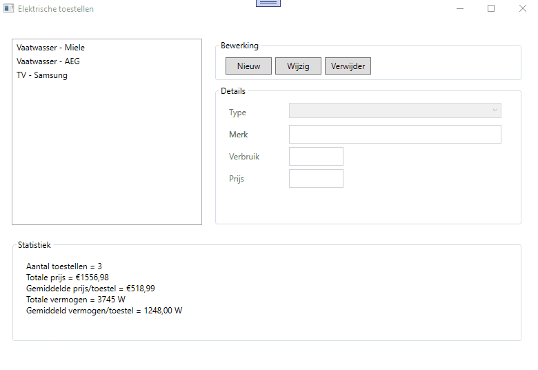

# Oefening klassen en eigenschappen : elektrische toestellen

In de starterscode vind je de nodige controls en eventhandlers terug in je venster.  
Je maakt zelf een class library aan (met de correcte naam) en je zorgt zelf voor de nodige referenties.  

Je programma dient een lijst bij te houden met verschillende elektrische toestellen die wij verkopen.  De lijst is een voorstelling van de toestellen die in onze winkel te koop staan.  

Van elk toestel houden we volgende bij :  
  * type, string, vereist : bv vaatwasser, oven, ... (zie demo)
  * merk, string, vereist
  * verbruik, int, >0
  * prijs, decimal, >0  

Je moet in staat zijn om nieuwe toestellen toe te voegen, te wijzigen of te verwijderen.  

Je dient ook onderaan je scherm een statistiek af te beelden (zie demo).  Deze statistiek dient voortdurend up to date te zijn.

Succes!
